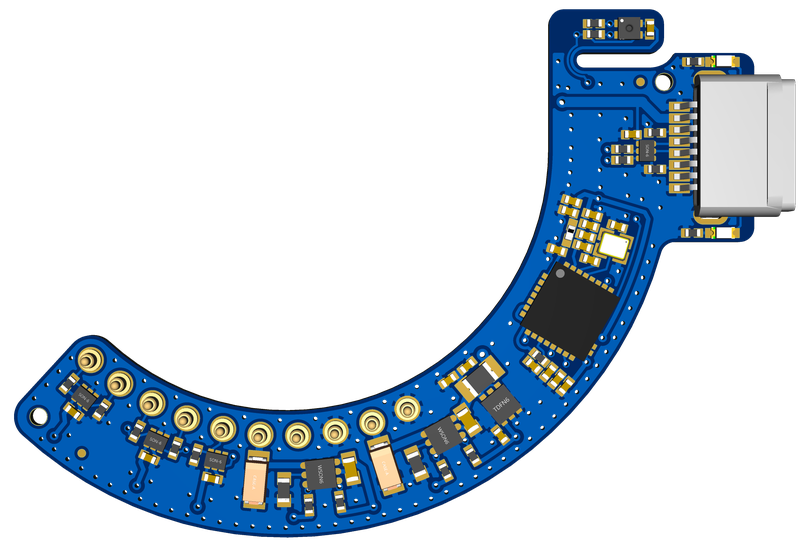
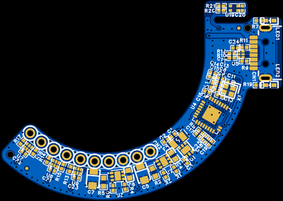
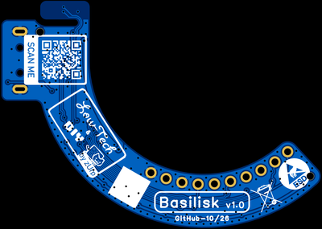

<!-- zurp-readme-header:begin — paste this block once, never again: the poster and the badges update themselves at each build of the site — do not edit it -->

<!-- zurp-readme-header:end -->

# Basilisk - Adapter

### Sleek but deadly Sony E adapter for astro cameras, bending glass to your will without leaving the warm room.
 Based on [Pinefeat](https://github.com/pinefeat/cef135).

 Put a Sony E lens on your astro camera and drive its focus and aperture from Ekos/INDI or ASCOM. First target lens: Samyang AF 135 F1.8 FE.

## Hardware

### Main board v1.0

#### Specs

* Ring-shaped board, 50.87 × 36.3 mm, parts on one side only
* One USB-C cable for power and data: no other supply, no camera body
* ESP32-C3 microcontroller, native USB
* Two switched, current-limited lens rails (5 V motor, 3.3 V logic), each reporting its faults
* 10-contact Sony E-mount lens interface on single pogo pins, with lens detection
* ESD protection on every lens line and on USB
* Status LED

#### PCB views
 

## Build Instructions

The v1.0 board goes to its first production run, but it is not validated yet: don't order it until it is.

### The fancy way : JLCPCB assembly service

Send the Gerbers, BoM and Pick-and-Place from `1_Board/` to JLCPCB and order the board assembled, top side only. The lens contacts are ten single pogo pins (P1–P10), listed in the BoM and the Pick-and-Place with the other top-side parts; the E-mount footprint CN2 is not wired. The PCB options are in the fabrication README, `1_Board/Basilisk-v1.0_0-README.txt`: 2 layers, 1.0 mm thick, 1 oz copper, black solder mask, white silkscreen, HASL RoHS finish.

### The hard way : Do It All Yourself

All files are in `1_Board/`: schematic, Gerbers, BoM, Pick-and-Place. Expect fine-pitch work: a QFN microcontroller, 0402 passives and tiny exposed-pad power parts.

### 3D case

The printable case is in `3_3D-Models/`, its CAD sources (STEP) in `2_Hardware/`.

## Firmware & software

* **Firmware** — `4_Firmware/` : ESP-IDF, no other dependency. Built for the ESP32-S3 (Seeed XIAO) for now, until the C3 board exists.
* **Bench page** — `5_App/` : one HTML page that drives the board from Chrome or Edge over Web Serial, nothing to install.
* **tool_station** — `5_App/tool_station/` : reads and sets the M1/M2 Custom switch of the Samyang AF 135, without Samyang's tool.
* **INDI driver** — `6_Driver/indi/` : `indi_basilisk_focus`, a focuser for Ekos; the stock Pinefeat drivers work too.

Documentation: `7_Docs/` — in French, the manual [`7_Docs/MANUEL.md`](7_Docs/MANUEL.md) and the serial protocol [`7_Docs/PROTOCOL.md`](7_Docs/PROTOCOL.md); in English, [`7_Docs/E-Mount/`](7_Docs/E-Mount/README.md), the Sony E-mount interoperability seen from the camera body: how a body talks to its lens.

## Arborescence

| folder | contents |
|---|---|
| `0_Datasheets/` | datasheets of the components |
| `1_Board/` | board manufacturing files |
| `2_Hardware/` | mechanics outside the board: enclosure, parts, design sources (STEP, F3D), mechanical BoM |
| `3_3D-Models/` | print-ready files (3MF, STL) |
| `4_Firmware/` | firmware: sources, build, tests |
| `5_App/` | PC / phone applications, configuration tools |
| `6_Driver/` | drivers (INDI, ASCOM…) |
| `7_Docs/` | project documentation: protocol, design notes, E-mount interoperability |
| `8_References/` | external reference documents (standards, upstream projects) |
| `9_Assets/` | README and documentation images; the site showcase (`zurp.yml` + poster) |

## About

Basilisk is part of [zUrp Astronomics](https://zurp-astronomics.github.io/).
Based on the Pinefeat project: the board speaks its serial protocol, so the Pinefeat INDI and ASCOM drivers work with it unchanged.
Designed by lordzurp — zUrp Astronomics

## Licences

- Software: [LICENSE](LICENSE)
- Hardware: [LICENSE-HARDWARE](LICENSE-HARDWARE)

Hardware and design (`1_Board/`, `2_Hardware/`, `3_3D-Models/`, `7_Docs/`, `9_Assets/`) are under OCL v1.1 ([`LICENSE-HARDWARE`](LICENSE-HARDWARE)); everything else is under MIT ([`LICENSE`](LICENSE)). Exceptions: `6_Driver/indi/` is under LGPL 2.1 (`6_Driver/indi/LICENSE`); the datasheets in `0_Datasheets/` and the third-party documents in `8_References/` belong to their authors; the lens-name tables generated from ExifTool (`4_Firmware/components/host/lens_names.c`, the `LENS_NAMES` table of `5_App/emount-bench.html`) keep their source's licence.
